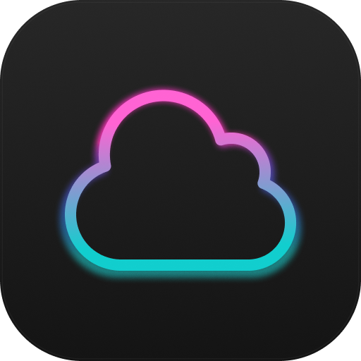
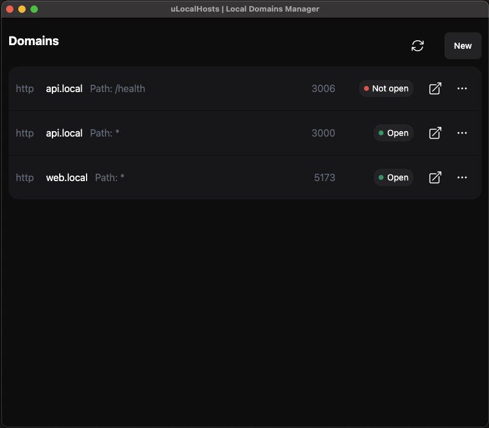

<p align="center">

</p>

  


## What is uLocalHosts?

ULocalHosts is a local domain manager for local environments. You can create easy-to-use .local domains as a proxy for your services.


Only for Mac OS.


<p align="center">

</p>


## Supporting ULocalHosts

ULocalHosts is an MIT-licensed open source project with its ongoing development made possible entirely by fantastic volunteers.


## Development

Pull requests are encouraged and always welcome. [Pick an issue](https://github.com/foxkdev/ulocalhosts/issues?q=is%3Aissue+is%3Aopen+sort%3Aupdated-desc) and help us out!

uLocaLHosts uses Electron.js to desktop app.

To install and work locally:

```bash
git clone https://github.com/foxkdev/ulocalhosts.git
cd ulocalhosts
yarn
```

> Do not use NPM to install the dependencies, as the specific package versions in `yarn.lock` are used to build and test.

To build the compiler and all the other modules included in the package:


```bash
yarn start
```


### Running Tests

```bash
yarn test
```

### Package app

```bash
yarn package
```

### Package make

To Make .zip with app ready to production

```bash
yarn make
```


## License

[MIT](LICENSE.md)